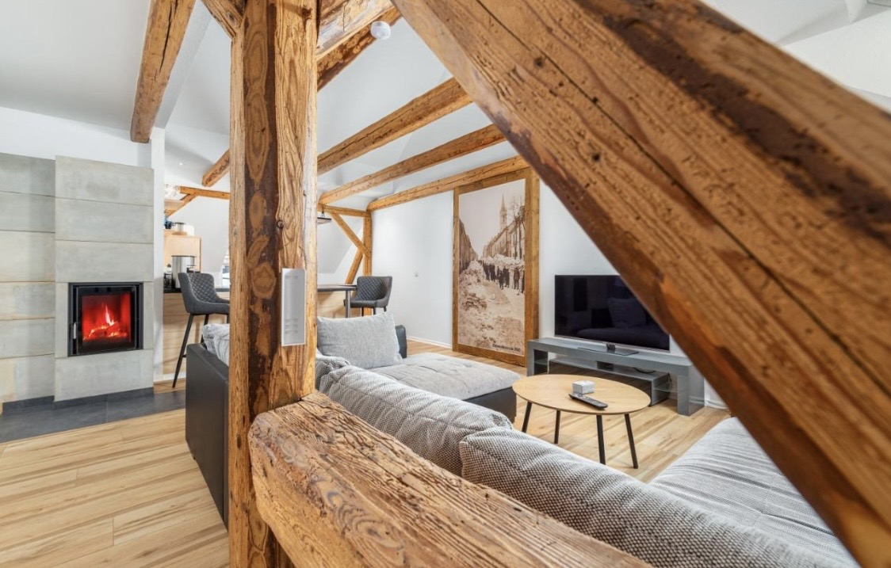

[🏠 Home](README.md) • [📅 Tag 1](tag1.md) • [📸 Fotos](fotos.md)
***

# 🌍 Mein Reiseblog 2026

**[🏠 Home](README.md) | [📍 tag1](tag1.md) | [📩 Kontakt](#)**
---

# Männerausflug 2026

Hier findet ihr alle Infos zum
Ausflug 2026.

---

# Unser Urlaub

| Navigation | Dein Reisebericht |
| :--- | :--- |
| **[🏠 Home](README.md)** **[📅 Tag 1](tag1.md)** **[📅 Tag 2](tag2.md)** **[📸 Galerie](fotos.md)** | ## Willkommen auf unserer Reise!    Hier schreiben wir täglich live von unserer Finca. Heute sind wir angekommen und die Sonne scheint herrlich...  |

* [Zum Reiseplan](#reiseplan)
* [Zur Packliste](#packliste)

---

## Reiseplan
Hier steht der Text...

## Packliste
- [ ] Koffer

## 📅 🗓️Die Eckdaten
* **Wann:** Freitag 10. Juli 11 Uhr
* **Unterkunft:** [Name des Hotels/Airbnb]
* **Treffpunkt:** [Uhrzeit/Ort für die Abfahrt]

## 🎒 Packliste (Nicht vergessen!)
- [ ] **Ausweis/Reisepass** (Gültig?!)
- [ ] Auslandskrankenversicherung
- [ ] Ladekabel & Powerbank
- [ ] [Spezifisches, z.B. Wanderschuhe oder Badehose]

## 🎬 Must-See: Erste Eindrücke
Damit ihr wisst, warum ich uns dort eingebucht habe:

1. **Die Altstadt/Strand:** [Hier YouTube-Link 1 einfügen]
2. **Der Geheimtipp:** [Hier YouTube-Link 2 einfügen]

---

### 📺 Video-Highlights
* [**Der Traumstrand** – *Hier klicken zum Video*](http://googleusercontent.com/youtube.com/7)
* [**Unsere Unterkunft** – *Rundgang durch das Haus*](http://googleusercontent.com/youtube.com/8)

> [!TIP]
> Ladet euch die Karte der Region bei Google Maps vorab **offline** herunter!

---
*Zuletzt aktualisiert: 04. April 2026*

