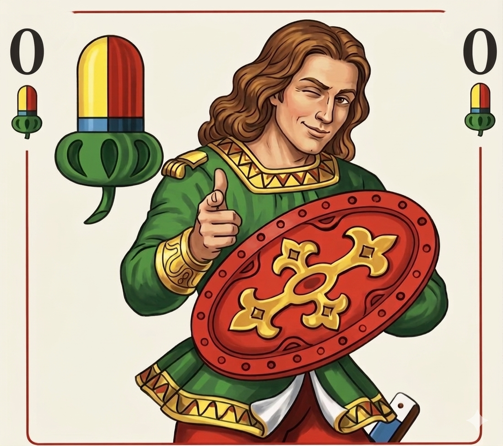

## 
+++Eichel-Ober-Reisen+++

---

# Kumpelz Ausflug 2026
Hier findet ihr die Infos, die ihr braucht!

---
## Update 7.7.2026
- [ ] Personalausweis
- [ ] Krankenkassenkarte

### Für den Bikepark
- [ ] Full Face Helm lässt sich vor Ort ausleihen (wenn verfügbar), kostet 13€
- [ ] Nehmt trotzdem normalen Fahrradhelm mit, falls Full Face Helm nicht verfügbar
- [ ] Fahrradhandschuhe, evtl. Arbeitshandschuhe (besser weil Langfinger)
- [ ] Sonnenbrille/Fahrradbrille
- [ ] Protectoren wenn ihr habt (ich nehm mein Rückenprotektor vom Moped mit)
- [ ] Empfehlenswert Knie- Ellenbogenschützer (laut Influencer; laut meinem 60 jährigen Arbeitskollegen gehts auch ohne)
- [ ] Trainingsjacke falls windig
- [ ] Sporthose zum Fahren, oder engere lange Hose, je nachdem wie ihr meint dass ihr schwitzt
- [ ] kleiner Rucksack für Snacks/Wasser
- [ ] es gibt oben eine Hütte, jedoch wird wohl die Hölle los sein, weil Samstag ist und perfekte Bedingungen herrschen

### Unterkunft
- [ ] Zugangscode (PIN): 3399 (alle Schlösser)
- [ ] WLAN: Apartman_3 / Horskyvzduch
- [ ] Allen Gästen stehen die Tische und Bänke neben dem Haus zur Verfügung.
- [ ] Wir bitten Sie, die Nachtruhe von 22:00 bis 7:00 Uhr einzuhalten
- [ ] Für Sie stehen Haar- und Duschshampoo, Flüssigseife, ein kleines Stück Seife sowie Körperlotion bereit.
- [ ] Außerdem finden Sie Handtücher, Badetücher und Badematten vor. Einen Haartrockner finden Sie in der Schublade unter dem Waschbecken

## Was machmer denn?
Ein Ausflug in die höchstgelegende Stadt Deutschlands, direkt an der tschechischen Grenze: Oberwiesenthal!

### Freitag 10.Juli 2026
- **11:00 Uhr**: Eichel-Ober-Reisen holt euch direkt zu Hause ab
- Aufbruch nach Oberwiesenthal
- *Programmpunkt 1*
- Ankunft in der Villa Kunterbunt am späten Nachmittag/früher Abend
- *Programmpunkt 2*
- **21:00 Uhr**: WM Viertelfinale

### Samstag 11. Juii 2026
- **8:00 Uhr**: Raus aus den Federn und kräftig frühstücken
- Grenzübertritt nach Tschechien zur *Hauptattraktion*: **Bikepark Klinovec**
- **Ganztags**: Wir rocken die Abfahrt und chillen bergauf
- Rückkehr zur Unterkunft
- **23:00 Uhr**: WM Viertelfinale

### Sonntag 12. Juli 2026
- **9:30 Uhr**: Checkout
- Rückreise nach Oberfranken
- *Programmpunkt 3*
- Ankunft in der Heimat am späten Nachmittag
- Abend zur *privaten* Entfaltung
 
---

## Wann spielt Schland?

| Gruppenphase | Viertelfinale |
|----------|----------|
| Erster | Donnerstag 22 Uhr |
| Zweiter | Samstag 23 Uhr |
| Dritter | Freitag 21 Uhr   Samstag 23 Uhr   Montag 3 Uhr|

Es besteht also eine geringe Chance, dass wir auf unserem Ausflug ein Deutschlandspiel haben!

---

## Was brauchmer denn?

- Ausweis/Reisepass (Gültig?!)
- Fahrradhelm
- Fahrradhandschuhe
- Fahrradbrille
- Sonnencreme
- Badehose / Handtuch
- ...

---

## Hast noch paar Infos?

### Video
- [**Bikepark**](https://youtu.be/mNEnyWZ2BRI?feature=shared)

### Fotos
- [**Bikepark**](https://www.trailpark.cz/de/galerie-2/)
- [**Unterkunft**](IMG_5486.JPG) 

### Links
- [**Beschreibung der Trails**](https://www.trailpark.cz/de/trails-und-ihre-sektionen/)
- [**Empfohlene Ausrüstung**](https://www.trailpark.cz/de/empfohlene-ausruestung-fuer-die-trails/)

---

---

## 
+++Eichel-Ober-Reisen+++

---

