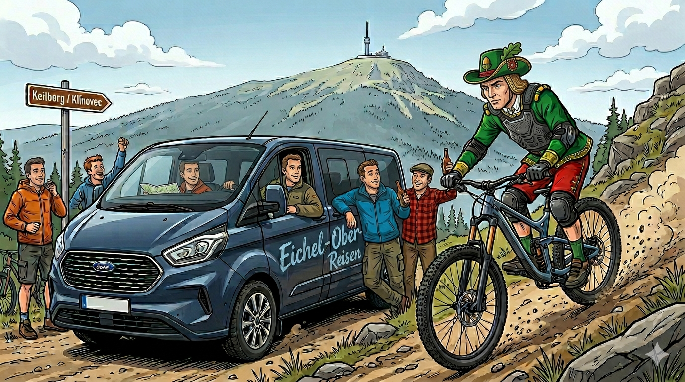

# Kumpelz Ausflug 2026
Hier findet ihr die Infos, die ihr braucht!

## Plan
**Eichel-Ober-Reisen präsentiert:  **
Ein Ausflug in die höchstgelegende Stadt Deutschlands... in den Kurort **Oberwiesenthal**.
Hier werden wir für 2 Nächte unser Lager beziehen

## Eckdaten
* **Wann:** Freitag 10. Juli 11 Uhr
* **Unterkunft:** [Name des Hotels/Airbnb]
* **Treffpunkt:** [Uhrzeit/Ort für die Abfahrt]

## Packliste (Stauraum vorhanden!)
- Ausweis/Reisepass (Gültig?!)
- Fahrradhelm
- Fahrradhandschuhe
- Fahrradbrille
- Sonnencreme
- Badehose / Handtuch
- ...

## Erste Eindrücke 

### 🎬 Video
- [**Bikepark**](https://youtu.be/mNEnyWZ2BRI?feature=shared)

### 📷 Fotos
- [**Bikepark**](https://www.trailpark.cz/de/galerie-2/)
- Unterkunft 

### 🔗 Links
* [**Beschreibung der Trails**](https://www.trailpark.cz/de/trails-und-ihre-sektionen/)
- [**Empfohlene Ausrüstung**](https://www.trailpark.cz/de/empfohlene-ausruestung-fuer-die-trails/)

